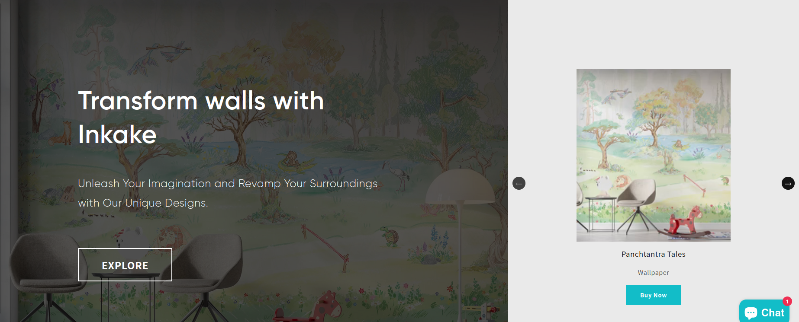
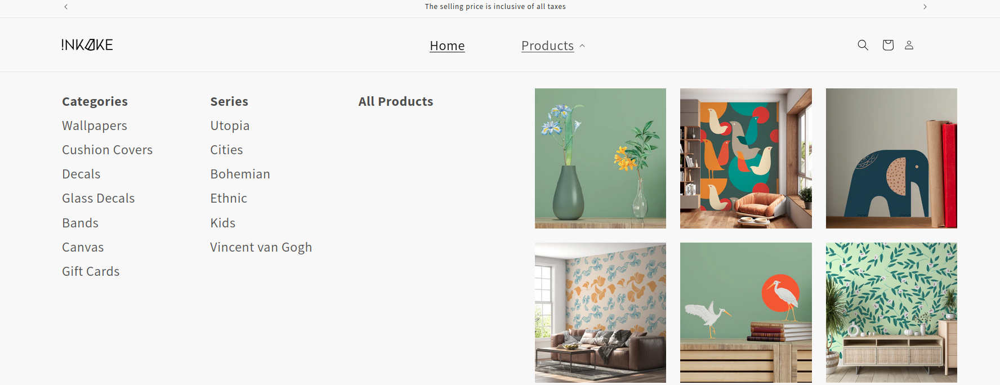
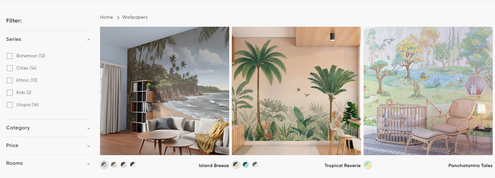
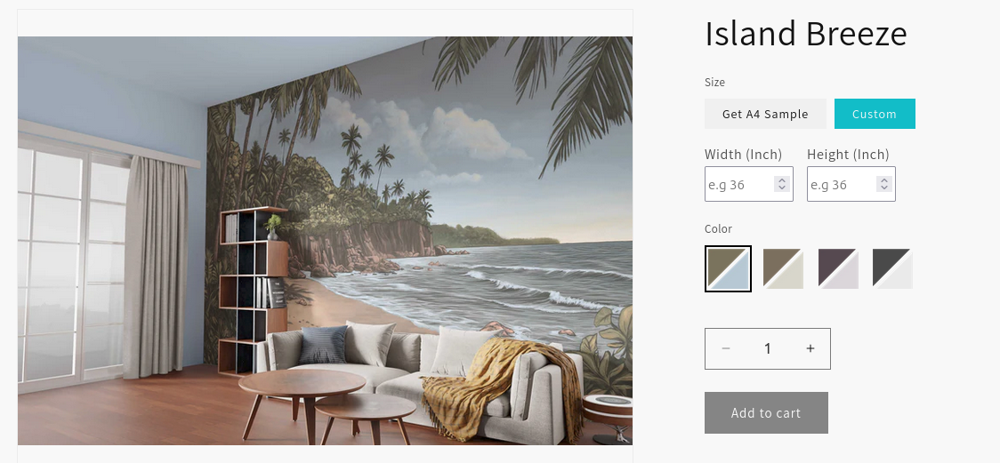

# Inkake Shopify 

## Url
https://inkake.com

## Homepage Hero Section

## Mega Menu Customization

## Collection Page Variant Selection

## Wallpaper Pricing Customization

## Project Overview

Inkake is a Shopify-based eCommerce website developed using the Dawn theme with Schema Version 11.0.0. The project involved heavy customization across multiple sections of the website to create a more unique and visually engaging shopping experience while still maintaining Shopify’s flexibility and ease of management.

The overall development focused on improving the homepage presentation, custom product functionality, responsive layouts, navigation experience, and smooth customer interaction across all devices.

## Homepage Customization

A large amount of customization work was done on the homepage to make the website visually attractive and more interactive for visitors. Several custom sections were developed including hero galleries, product tabs, promotional sections, and content blocks.

The hero gallery section was customized carefully to support better product showcasing while maintaining smooth responsiveness across different screen sizes. Product tab sections were also developed in a way that allows visitors to browse different categories quickly without making the homepage feel crowded.

The goal was to create a modern homepage experience while keeping the loading speed balanced and the content structure easy to manage from the Shopify backend.

## Inner Page Development

Customizations were not limited only to the homepage. Several inner CMS pages were also customized based on the design and content requirements of the website.

The sections were developed in a flexible way so content updates can be managed easily later from the Shopify admin panel. The focus was to maintain design consistency throughout the website while giving enough flexibility for future content changes.

## Mega Menu Customization

The header navigation required custom mega menu development to improve product discovery and navigation structure.

The default Dawn theme navigation was modified to support a more organized mega menu layout with better category presentation. This helped users browse products and collections more comfortably, especially on larger screens.

Special attention was also given to mobile navigation because a large portion of Shopify traffic usually comes from mobile users. The mobile menu behavior was optimized carefully so navigation remains smooth and user-friendly on smaller devices.

## Mobile Responsive Development

Mobile responsiveness was one of the major focuses during the project. Every custom section including the header, footer, homepage sections, sliders, galleries, and collection layouts was tested and optimized for mobile devices, tablets, and desktops.

The goal was to ensure that the website maintains proper spacing, alignment, readability, and functionality across all screen sizes without breaking layouts or affecting usability.

## Variant Selection on Collection Pages

Custom variant selection functionality was implemented directly inside collection pages. This allowed customers to select product variants without visiting every individual product page separately.

This customization helped improve user convenience and made the browsing and shopping process faster. It also helped reduce unnecessary page loads and improved the overall shopping experience.

## Wallpaper Product Pricing Customization

One of the most important custom developments in this project was the wallpaper product pricing functionality.

For products under the Wallpaper collection, customers can enter custom width and height values directly on the product page. Based on the user-provided measurements, a custom pricing algorithm calculates the final product price dynamically.

The entered dimensions are not only used for pricing calculation but are also carried properly into the cart page, checkout page, and final order details. This ensures that the customer-selected measurements remain attached throughout the complete order process.

Handling this type of customization inside Shopify required careful frontend and backend integration because Shopify’s default product structure does not directly support advanced custom measurement-based pricing systems.

The logic was developed carefully to make the calculations accurate while keeping the customer experience smooth and easy to understand.

## Challenges During Development

One common challenge during the project was maintaining website performance while adding multiple heavy customizations across the homepage and inner pages.

Shopify themes can become slower if custom scripts and sections are not handled properly. To avoid this issue, the development focused on cleaner code structure, optimized scripts, and lightweight implementation methods.

Another challenge was handling dynamic pricing calculations for wallpaper products. Since the pricing depended on custom user inputs instead of fixed product pricing, additional logic had to be developed carefully to maintain proper pricing flow from product page to checkout and order creation.

Responsive behavior for custom sections was also an important challenge because several layouts were highly customized beyond the default Dawn theme structure. Each section was tested carefully across different devices to maintain consistency and usability.

Mega menu responsiveness on mobile devices also required extra attention because large navigation structures can easily become difficult to use on smaller screens. The final implementation focused on keeping navigation clean and simple while maintaining accessibility.

## Final Outcome

The final website successfully combined custom Shopify development with a clean and user-friendly shopping experience.

The project included advanced homepage customization, custom mega menu development, responsive layouts, collection page variant handling, dynamic wallpaper pricing calculation, and complete order data flow management.

The website was developed not only to look visually modern but also to handle complex functionality smoothly while remaining manageable from the Shopify admin panel for future updates and product management.
